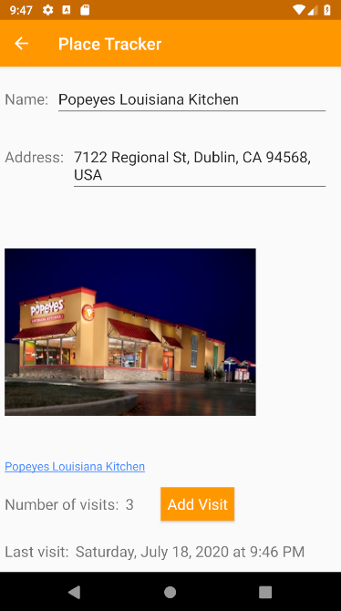
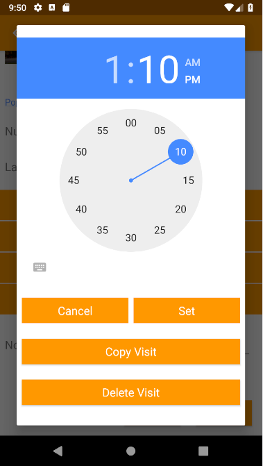

# Capstone-Project
A simple way to keep track of places you've visited. You can use Place Tracker to remember what restaurants you've
eaten at, save your latest doctor's appointment, or whatever you'd like.

## Installation
To run the app from this repository, you need to:
1. Create an account on the [Google Cloud Platform](https://accounts.google.com/signin/v2/identifier?service=cloudconsole&passive=1209600&osid=1&continue=https%3A%2F%2Fconsole.cloud.google.com%2F%3Fref%3Dhttps%3A%2F%2Fwww.google.com%2F&followup=https%3A%2F%2Fconsole.cloud.google.com%2F%3Fref%3Dhttps%3A%2F%2Fwww.google.com%2F&flowName=GlifWebSignIn&flowEntry=ServiceLogin).
2. Add a billing account.
3. Enable the Places API from your console.
4. Create an API key and register your device's SHA-1 fingerprint. See [these instructions](https://developers.google.com/places/android-sdk/get-api-key).
5. Create a String resource file called `secrets.xml`. Add a String resource with the name `google_places_api_key`
and the value set to this API key.
For example, you can just copy-paste this file into the "values" folder, replacing YOUR_API_KEY with your API key:

```
<?xml version="1.0" encoding="utf-8"?>
<resources>
    <string name="google_places_api_key">YOUR_API_KEY</string>
</resources>
```

6. Clone this repository, open the cloned folder in Android Studio, and run the app.

## Download
The app is currently available in open beta.

<a href='https://play.google.com/store/apps/details?id=com.michaelhsieh.placetracker&pcampaignid=pcampaignidMKT-Other-global-all-co-prtnr-py-PartBadge-Mar2515-1'></a>

## Screenshots






